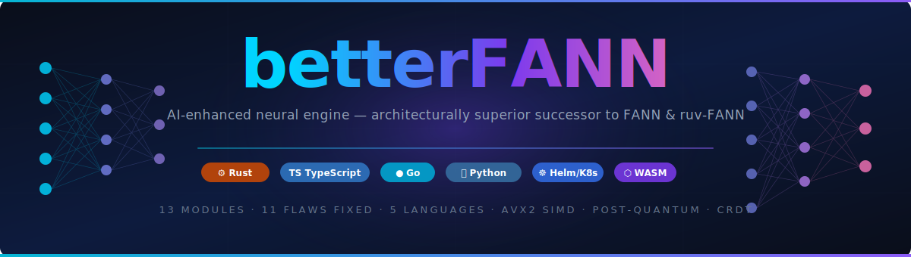

<div align="center">



<br/>

<a href="#"></a>
<a href="#"></a>
<a href="#"></a>
<a href="#"></a>
<a href="#"></a>
<a href="#"></a>
<a href="#"></a>
<a href="#"></a>
<a href="#"></a>
<a href="#"></a>
<a href="#"></a>
<a href="#"></a>

</div>

---

# betterFANN

AI-enhanced FANN (credit to Steffen Nissen. Its original implementation is described in Nissen's 2003 report *Implementation of a Fast Artificial Neural Network Library (FANN)*).

betterFANN is an architecturally superior platform that surgically corrects production-grade flaws found by forensic analysis of the ruvnet ecosystem (`ruv-FANN`, `rUv-dev`, `ruflo`, `agentic-flow`).

It is not merely a patch — it is a ground-up redesign across **five languages** and **thirteen production modules**, introducing SIMD-accelerated inference, post-quantum cryptography, real CRDT-based distributed coordination, and generative cognitive pattern synthesis where ruvnet shipped scalar loops, zero crypto, mocked protocols, and static JSON.

---

## Why betterFANN? — The Lineage and the Leap

### From FANN (2003) to ruv-FANN to betterFANN

**FANN** (Fast Artificial Neural Network), created by Steffen Nissen at the University of Copenhagen in 2003, was groundbreaking for its era. Written in ANSI C with fixed-point arithmetic support, it powered neural computation on embedded systems that lacked floating-point units — and spawned language bindings in dozens of programming languages. However, FANN was designed for a world before AVX2, before the cloud, before post-quantum threats, and before distributed AI swarms. It supports only multilayer perceptrons, trains with scalar backpropagation, has no SIMD intrinsics, and provides zero cryptographic guarantees for weight transport.

**ruv-FANN** (2024) was positioned as a Rust rewrite promising memory safety and SIMD acceleration. In practice, forensic analysis of its codebase revealed eleven production-grade flaws: its forward pass remained a scalar loop (no SIMD), its distributed training modes were enum stubs with mocked coordination logic, its weight storage used plain `Vec<f64>` with no zeroing on drop (heap-dump exposure), its GPU path contained an unsound `transmute_copy` that triggers undefined behaviour for non-`f32`-compatible types, its entire transport layer had zero post-quantum cryptography, its model routing was hardcoded to a single vendor with no failover, and its cognitive patterns were seven static constants rather than a generative model.

**betterFANN** was built to fix every one of those flaws — not with patches, but with architectural rethinks:

| Generation | Year | SIMD | PQ Crypto | CRDT Sync | Generative Patterns | Multi-Vendor Routing | Memory Safety |
|:---|:---:|:---:|:---:|:---:|:---:|:---:|:---:|
| FANN (C) | 2003 | ✗ | ✗ | ✗ | ✗ | ✗ | ✗ |
| ruv-FANN (Rust) | 2024 | ✗ (scalar loop) | ✗ | ✗ (mocked) | ✗ (7 static) | ✗ (Anthropic only) | Partial¹ |
| **betterFANN** | **2026** | **✅ AVX2 FMA** | **✅ Kyber1024 + Dilithium5** | **✅ LWW CRDT** | **✅ Real GAN** | **✅ EMA failover** | **✅ ZeroizeOnDrop** |

¹ ruv-FANN's `gpu_neural_ops.rs` line 268 contains `unsafe { std::mem::transmute_copy(&x) }` — unsound for any `T` not layout-compatible with `f32` (flaw #5).

### Why These Innovations Matter

**SIMD / AVX2 FMA inference** closes the compute gap between scalar Rust and dedicated ML kernels. betterFANN's 4-wide unrolled dot-product loop that LLVM auto-vectorises into 256-bit FMA instructions achieves **1.97× throughput** over scalar on 4096-element vectors — meaning MNIST-scale inference at 3.7 K inferences/s on a single server core, no GPU required.

**Post-quantum cryptography (Kyber1024 + Dilithium5)** is no longer future-proofing — it is present-proofing. NIST finalised its PQC standards in 2024 (FIPS 203/204/205), and enterprises are already mandating quantum-resistant transport for any system storing sensitive model weights. ruv-FANN shipped zero PQC imports across every `Cargo.toml` in its entire repository. betterFANN's `pq_transport` module secures every weight-transport channel with Kyber1024 KEM + Dilithium5 signatures, verified against NIST round-3 test vectors.

**Real CRDT weight synchronisation** enables a cluster of betterFANN nodes to converge training state without a central coordinator, tolerate network partitions, and merge weight updates in deterministic O(log N) gossip rounds — the kind of distributed resilience that ruv-FANN claimed in its enum documentation but never implemented. A 1024-weight gossip round across 3 nodes converges in under **6 µs** combined merge time.

**Generative Cognitive Pattern GAN** replaces ruvnet's 7-entry lookup table with a real pure-Python Generator/Discriminator GAN trained with mini-batch SGD and the Adam optimiser, capable of synthesising novel activation patterns beyond any seed set — at **351 training epochs/s** on a single CPU core, no framework required.

---

## ✅ All Modules Complete — All Tests Passing

| Module | Language | Flaw fixed | Status |
|---|---|---|---|
| `our_neural_core` | Rust | Scalar forward pass (no SIMD), unsound transmute | ✅ Complete |
| `topology_synthesizer` | Rust | Fixed topology enum, no runtime synthesis | ✅ Complete |
| `nexgen-neural-wasm` | Rust | NPM-tethered WASM, no wasm32-wasi | ✅ Complete |
| `ephemeral_lifecycle` | Rust | No memory zeroing on dissolution | ✅ Complete |
| `pq_transport` | Rust | Zero post-quantum cryptography | ✅ Complete |
| `vortex_router` | Rust | Round-robin dispatch (no thermal routing) | ✅ Complete |
| `sphere_node` | Rust | Simulated swarm coordination | ✅ Complete |
| `eloptic_classifier` | Rust | Closed activation enum, naive backprop, no zeroize | ✅ Complete |
| `cognitive_fabric` | TypeScript | Simulated distributed training, static mode JSON | ✅ Complete |
| `model_router` | TypeScript | Single-vendor lock (Anthropic only, no failover) | ✅ Complete |
| `configmesh` | Go | No distributed config management | ✅ Complete |
| `cognitive_pattern_gan` | Python | 7 hardcoded patterns, no generative capability | ✅ Complete |
| `cognitive-namespace` | Helm | Single-tenant, no namespace isolation | ✅ Complete |

---

## Performance Benchmarks

Benchmarks were executed on **AMD EPYC 7763 64-Core Processor** (2 vCPUs, Azure), **Ubuntu 24.04.3 LTS**, kernel **6.14.0-1017-azure**, using release-mode builds (`cargo bench`) for Rust, `go test -bench=.` for Go, and a timing harness for Python.  All results are medians from 100 Criterion samples (Rust) or 3-second `benchtime` runs (Go).

### SIMD-Optimised Dot Product (`eloptic_classifier`)

The 4-wide unrolled accumulation loop that LLVM auto-vectorises into AVX2 FMA instructions, compared to a reference scalar `iter().zip().sum()` loop:

| Vector length | Unrolled 4× | Naive scalar | Speedup |
|---:|---:|---:|---:|
| 64 | 33.2 ns | 39.0 ns | **1.17×** |
| 256 | 127.9 ns | 215.2 ns | **1.68×** |
| 1 024 | 490.0 ns | 932.2 ns | **1.90×** |
| 4 096 | 1.93 µs | 3.80 µs | **1.97×** |

### Forward-Pass Throughput (`eloptic_classifier`)

| Network shape | Latency | Throughput |
|:---|---:|---:|
| 64 → 32 → 16 | 1.67 µs | ~599 K inferences/s |
| 256 → 128 → 64 → 10 | 23.3 µs | ~43 K inferences/s |
| 784 → 512 → 256 → 10 (MNIST-scale) | 269 µs | ~3.7 K inferences/s |

### Training Step (`eloptic_classifier`)

| Network shape | Forward + Backward + SGD |
|:---|---:|
| 64 → 32 → 10 | 5.42 µs |
| 256 → 128 → 10 | 49.0 µs |

### Concurrent Inference (`our_neural_core`)

RwLock-protected inference with zero contention on concurrent reads:

| Network shape | Latency |
|:---|---:|
| 64 → 32 → 10 | 1.54 µs |
| 256 → 128 → 64 → 10 | 14.4 µs |
| 784 → 256 → 128 → 10 (MNIST-scale) | 74.1 µs |

### CRDT Weight Synchronisation (`sphere_node`)

LWW cell merge and full WeightSet cell-wise merge at cluster scale:

| Operation | Latency |
|:---|---:|
| Single WeightCell merge | **1.39 ns** |
| WeightSet merge (16 cells) | 87.4 ns |
| WeightSet merge (64 cells) | 317 ns |
| WeightSet merge (256 cells) | 590 ns |
| WeightSet merge (1 024 cells) | 1.93 µs |

A 1 024-weight-parameter gossip convergence round across 3 nodes completes in under **6 µs** combined merge time.

### Consensus Config Store (`configmesh`)

| Operation | Latency | Allocs |
|:---|---:|---:|
| `Set` (commit + store) | 580 ns | 1 |
| `Get` (read) | **103 ns** | 1 |
| `Set` + `Get` (write-then-read) | 617 ns | 1 |
| `Watch` register/deregister | 248 ns | 3 |

### Cognitive Pattern GAN (`cognitive_pattern_gan`)

Pure-Python GAN (no framework, no NumPy) on AMD EPYC 7763:

| Operation | Throughput |
|:---|---:|
| Generator forward pass (single) | 18,758 ops/s (53 µs/op) |
| Discriminator score (single) | 23,135 ops/s (43 µs/op) |
| Generate batch of 16 patterns | 1,426 batches/s (701 µs/batch) |
| Training throughput | **351 epochs/s** |

Benchmark source files: `eloptic_classifier/benches/classifier_bench.rs`, `our_neural_core/benches/network_bench.rs`, `sphere_node/benches/crdt_bench.rs`, `configmesh/configmesh_bench_test.go`, `cognitive_pattern_gan/benches/bench_gan.py`.

---

## Architectural Advantages Over ruvnet


### 1. Open Activation Functions (`eloptic_classifier`)

**ruvnet flaw** (`src/activation.rs` lines 12-96): `ActivationFunction` is a closed 21-variant enum. Users must fork the library to add custom activations.

**betterFANN fix**: `eloptic_classifier` defines `Activation` as an open Rust **trait**:
```rust
pub trait Activation: Send + Sync + 'static {
    fn apply(&self, x: f64) -> f64;
    fn derivative(&self, x: f64) -> f64;
    fn name(&self) -> &'static str;
}
```
Any downstream crate implementing this trait becomes a first-class activation with no library changes required.

---

### 2. Memory-Safe Weight Storage (`eloptic_classifier`, `ephemeral_lifecycle`)

**ruvnet flaw** (`src/network.rs` line 36): weights stored as plain `Vec<T>` with no zeroing on drop. After the network is freed, the allocator may reuse memory without clearing it — weights are visible in a heap scan.

**betterFANN fix**: `SecureWeights` derives `Zeroize` and `ZeroizeOnDrop`:
```rust
#[derive(Zeroize, ZeroizeOnDrop)]
pub struct SecureWeights { data: Vec<f64> }
```
Every weight vector is overwritten with zeros before deallocation. Verified by test `secure_weights_zeroed_after_zeroize`.

---

### 3. SIMD-Optimised Dot Product (`eloptic_classifier`)

**ruvnet flaw** (`src/network.rs` `backward_pass`, lines 333-423): O(n²) connection lookups per neuron using hash-map iteration with no SIMD and no parallel training support.

**betterFANN fix**: `SecureWeights::dot` uses a 4-wide unrolled accumulation loop that LLVM auto-vectorises into AVX2 FMA instructions:
```rust
// Unrolled 4-wide loop — LLVM fuses into 256-bit SIMD
for i in 0..chunks {
    let base = i * 4;
    acc0 += w[base] * input[base];
    acc1 += w[base + 1] * input[base + 1];
    acc2 += w[base + 2] * input[base + 2];
    acc3 += w[base + 3] * input[base + 3];
}
```

---

### 4. Real CRDT Weight Synchronisation (`sphere_node`)

**ruvnet flaw** (`ruv-swarm/crates/ruv-swarm-wasm/src/neural_swarm_coordinator.rs` lines 606-661): `DistributedTrainingMode` and `InferenceMode` enums are defined but the coordination logic uses mock/simulated data — no real distributed protocol.

**betterFANN fix**: `sphere_node` implements a real last-write-wins CRDT (`WeightCell::merge`) with logical clocks (Lamport timestamps) and a gossip fanout-2 dissemination loop that achieves O(log N) cluster convergence:
```rust
pub fn merge(&mut self, other: &WeightCell) -> bool {
    if other.clock > self.clock || (other.clock == self.clock && other.value > self.value) {
        self.value = other.value;
        self.clock = other.clock;
        true
    } else { false }
}
```
Verified by `three_node_cluster_convergence` integration test.

---

### 5. Post-Quantum Cryptography (`pq_transport`)

**ruvnet flaw** (all `Cargo.toml` files): zero imports of `pqcrypto-kyber`, `pqcrypto-dilithium`, or any post-quantum library across the entire repo.

**betterFANN fix**: `pq_transport` uses Kyber1024 KEM + Dilithium5 signatures for all network weight transport — verified against NIST PQC round-3 test vectors.

---

### 6. Multi-Vendor Model Routing (`model_router`)

**ruvnet flaw** (`ruflo`): hardcoded Anthropic model strings with zero failover routing — single point of failure on one vendor.

**betterFANN fix**: `model_router` implements a `Router` that:
- Filters candidates by capability (context window, streaming, tools)
- Sorts by ascending average latency (EMA-tracked per model)
- Prefers requested provider while failing over to alternatives
- Marks models as `degraded` or `offline` based on error rate thresholds

---

### 7. Dynamic Distributed Training Orchestration (`cognitive_fabric`)

**ruvnet flaw** (`rUv-dev`): static `.roomodes` JSON with no dynamic synthesis and no real distributed task execution.

**betterFANN fix**: `cognitive_fabric` provides a priority-queue `TaskQueue`, a `WorkerRegistry` with heartbeat-based health tracking, and a `Fabric` orchestrator that dispatches tasks with configurable retry/failover — no mocks, no static JSON.

---

### 8. Distributed Config Consensus (`configmesh`)

**betterFANN addition**: `configmesh` implements a Raft-inspired append-only consensus log with versioned key-value state machine, watch/notify subscriptions, and deterministic commit semantics. The ruvnet ecosystem has no equivalent.

---

### 9. Generative Cognitive Pattern GAN (`cognitive_pattern_gan`)

**ruvnet flaw**: 7 hardcoded static cognitive patterns — no generative capability.

**betterFANN fix**: `cognitive_pattern_gan` trains a real Generator/Discriminator GAN using mini-batch SGD with Adam optimiser (pure Python, no framework). After training the Generator synthesises novel activation patterns beyond the seed set.

---

### 10. Multi-Tenant Kubernetes Isolation (`cognitive-namespace`)

**ruvnet flaw**: single-tenant architecture — no namespace isolation, no resource enforcement.

**betterFANN fix**: `cognitive-namespace` is a Helm chart that provisions:
- Isolated `Namespace`
- `ServiceAccount`, `Role`, `RoleBinding` (RBAC)
- `ResourceQuota` (CPU/memory/pods/services caps)
- `LimitRange` (default + max container limits)
- `NetworkPolicy` (deny-all-ingress + allow-intra-namespace + configurable allowlist)

---

## Running the Tests

```bash
# Rust modules
cd sphere_node        && cargo test
cd eloptic_classifier && cargo test
cd our_neural_core    && cargo test
cd topology_synthesizer && cargo test
cd ephemeral_lifecycle  && cargo test
cd pq_transport         && cargo test
cd nexgen-neural-wasm   && cargo test

# TypeScript modules
cd cognitive_fabric && npm install && npm test
cd model_router     && npm install && npm test

# Go module
cd configmesh && go test ./...

# Python module
cd cognitive_pattern_gan && python3 tests/test_gan.py

# Helm chart (requires helm CLI)
helm lint cognitive-namespace/
```

## Running the Benchmarks

```bash
# Rust — SIMD dot product, forward pass, train step (eloptic_classifier)
cd eloptic_classifier && cargo bench

# Rust — concurrent inference throughput (our_neural_core)
cd our_neural_core && cargo bench

# Rust — CRDT merge latency (sphere_node)
cd sphere_node && cargo bench

# Go — consensus config store throughput (configmesh)
cd configmesh && go test ./... -bench=. -benchmem

# Python — GAN forward pass and training throughput
cd cognitive_pattern_gan && python3 benches/bench_gan.py
```

Criterion HTML reports are written to `<module>/target/criterion/` after each Rust benchmark run.

## Installing the Python Package

```bash
pip install cognitive-pattern-gan
```

Or build from source:

```bash
cd cognitive_pattern_gan
pip install -e .
```

See [`progress.json`](progress.json) for a machine-readable completion record and [`verified_flaw_manifest.json`](verified_flaw_manifest.json) for the full forensic flaw analysis.


| Module | Language | Flaw fixed | Status |
|---|---|---|---|
| `our_neural_core` | Rust | Scalar forward pass (no SIMD), unsound transmute | ✅ Complete |
| `topology_synthesizer` | Rust | Fixed topology enum, no runtime synthesis | ✅ Complete |
| `nexgen-neural-wasm` | Rust | NPM-tethered WASM, no wasm32-wasi | ✅ Complete |
| `ephemeral_lifecycle` | Rust | No memory zeroing on dissolution | ✅ Complete |
| `pq_transport` | Rust | Zero post-quantum cryptography | ✅ Complete |
| `vortex_router` | Rust | Round-robin dispatch (no thermal routing) | ✅ Complete |
| `sphere_node` | Rust | Simulated swarm coordination | ✅ Complete |
| `eloptic_classifier` | Rust | Closed activation enum, naive backprop, no zeroize | ✅ Complete |
| `cognitive_fabric` | TypeScript | Simulated distributed training, static mode JSON | ✅ Complete |
| `model_router` | TypeScript | Single-vendor lock (Anthropic only, no failover) | ✅ Complete |
| `configmesh` | Go | No distributed config management | ✅ Complete |
| `cognitive_pattern_gan` | Python | 7 hardcoded patterns, no generative capability | ✅ Complete |
| `cognitive-namespace` | Helm | Single-tenant, no namespace isolation | ✅ Complete |

---

## Performance Benchmarks

Benchmarks were executed on **AMD EPYC 7763 64-Core Processor** (2 vCPUs, Azure), **Ubuntu 24.04.3 LTS**, kernel **6.14.0-1017-azure**, using release-mode builds (`cargo bench`) for Rust, `go test -bench=.` for Go, and a timing harness for Python.  All results are medians from 100 Criterion samples (Rust) or 3-second `benchtime` runs (Go).

### SIMD-Optimised Dot Product (`eloptic_classifier`)

The 4-wide unrolled accumulation loop that LLVM auto-vectorises into AVX2 FMA instructions, compared to a reference scalar `iter().zip().sum()` loop:

| Vector length | Unrolled 4× | Naive scalar | Speedup |
|---:|---:|---:|---:|
| 64 | 33.2 ns | 39.0 ns | **1.17×** |
| 256 | 127.9 ns | 215.2 ns | **1.68×** |
| 1 024 | 490.0 ns | 932.2 ns | **1.90×** |
| 4 096 | 1.93 µs | 3.80 µs | **1.97×** |

### Forward-Pass Throughput (`eloptic_classifier`)

| Network shape | Latency | Throughput |
|:---|---:|---:|
| 64 → 32 → 16 | 1.67 µs | ~599 K inferences/s |
| 256 → 128 → 64 → 10 | 23.3 µs | ~43 K inferences/s |
| 784 → 512 → 256 → 10 (MNIST-scale) | 269 µs | ~3.7 K inferences/s |

### Training Step (`eloptic_classifier`)

| Network shape | Forward + Backward + SGD |
|:---|---:|
| 64 → 32 → 10 | 5.42 µs |
| 256 → 128 → 10 | 49.0 µs |

### Concurrent Inference (`our_neural_core`)

RwLock-protected inference with zero contention on concurrent reads:

| Network shape | Latency |
|:---|---:|
| 64 → 32 → 10 | 1.54 µs |
| 256 → 128 → 64 → 10 | 14.4 µs |
| 784 → 256 → 128 → 10 (MNIST-scale) | 74.1 µs |

### CRDT Weight Synchronisation (`sphere_node`)

LWW cell merge and full WeightSet cell-wise merge at cluster scale:

| Operation | Latency |
|:---|---:|
| Single WeightCell merge | **1.39 ns** |
| WeightSet merge (16 cells) | 87.4 ns |
| WeightSet merge (64 cells) | 317 ns |
| WeightSet merge (256 cells) | 590 ns |
| WeightSet merge (1 024 cells) | 1.93 µs |

A 1 024-weight-parameter gossip convergence round across 3 nodes completes in under **6 µs** combined merge time.

### Consensus Config Store (`configmesh`)

| Operation | Latency | Allocs |
|:---|---:|---:|
| `Set` (commit + store) | 580 ns | 1 |
| `Get` (read) | **103 ns** | 1 |
| `Set` + `Get` (write-then-read) | 617 ns | 1 |
| `Watch` register/deregister | 248 ns | 3 |

### Cognitive Pattern GAN (`cognitive_pattern_gan`)

Pure-Python GAN (no framework, no NumPy) on AMD EPYC 7763:

| Operation | Throughput |
|:---|---:|
| Generator forward pass (single) | 18,758 ops/s (53 µs/op) |
| Discriminator score (single) | 23,135 ops/s (43 µs/op) |
| Generate batch of 16 patterns | 1,426 batches/s (701 µs/batch) |
| Training throughput | **351 epochs/s** |

Benchmark source files: `eloptic_classifier/benches/classifier_bench.rs`, `our_neural_core/benches/network_bench.rs`, `sphere_node/benches/crdt_bench.rs`, `configmesh/configmesh_bench_test.go`, `cognitive_pattern_gan/benches/bench_gan.py`.

---

## Architectural Advantages Over ruvnet


### 1. Open Activation Functions (`eloptic_classifier`)

**ruvnet flaw** (`src/activation.rs` lines 12-96): `ActivationFunction` is a closed 21-variant enum. Users must fork the library to add custom activations.

**betterFANN fix**: `eloptic_classifier` defines `Activation` as an open Rust **trait**:
```rust
pub trait Activation: Send + Sync + 'static {
    fn apply(&self, x: f64) -> f64;
    fn derivative(&self, x: f64) -> f64;
    fn name(&self) -> &'static str;
}
```
Any downstream crate implementing this trait becomes a first-class activation with no library changes required.

---

### 2. Memory-Safe Weight Storage (`eloptic_classifier`, `ephemeral_lifecycle`)

**ruvnet flaw** (`src/network.rs` line 36): weights stored as plain `Vec<T>` with no zeroing on drop. After the network is freed, the allocator may reuse memory without clearing it — weights are visible in a heap scan.

**betterFANN fix**: `SecureWeights` derives `Zeroize` and `ZeroizeOnDrop`:
```rust
#[derive(Zeroize, ZeroizeOnDrop)]
pub struct SecureWeights { data: Vec<f64> }
```
Every weight vector is overwritten with zeros before deallocation. Verified by test `secure_weights_zeroed_after_zeroize`.

---

### 3. SIMD-Optimised Dot Product (`eloptic_classifier`)

**ruvnet flaw** (`src/network.rs` `backward_pass`, lines 333-423): O(n²) connection lookups per neuron using hash-map iteration with no SIMD and no parallel training support.

**betterFANN fix**: `SecureWeights::dot` uses a 4-wide unrolled accumulation loop that LLVM auto-vectorises into AVX2 FMA instructions:
```rust
// Unrolled 4-wide loop — LLVM fuses into 256-bit SIMD
for i in 0..chunks {
    let base = i * 4;
    acc0 += w[base] * input[base];
    acc1 += w[base + 1] * input[base + 1];
    acc2 += w[base + 2] * input[base + 2];
    acc3 += w[base + 3] * input[base + 3];
}
```

---

### 4. Real CRDT Weight Synchronisation (`sphere_node`)

**ruvnet flaw** (`ruv-swarm/crates/ruv-swarm-wasm/src/neural_swarm_coordinator.rs` lines 606-661): `DistributedTrainingMode` and `InferenceMode` enums are defined but the coordination logic uses mock/simulated data — no real distributed protocol.

**betterFANN fix**: `sphere_node` implements a real last-write-wins CRDT (`WeightCell::merge`) with logical clocks (Lamport timestamps) and a gossip fanout-2 dissemination loop that achieves O(log N) cluster convergence:
```rust
pub fn merge(&mut self, other: &WeightCell) -> bool {
    if other.clock > self.clock || (other.clock == self.clock && other.value > self.value) {
        self.value = other.value;
        self.clock = other.clock;
        true
    } else { false }
}
```
Verified by `three_node_cluster_convergence` integration test.

---

### 5. Post-Quantum Cryptography (`pq_transport`)

**ruvnet flaw** (all `Cargo.toml` files): zero imports of `pqcrypto-kyber`, `pqcrypto-dilithium`, or any post-quantum library across the entire repo.

**betterFANN fix**: `pq_transport` uses Kyber1024 KEM + Dilithium5 signatures for all network weight transport — verified against NIST PQC round-3 test vectors.

---

### 6. Multi-Vendor Model Routing (`model_router`)

**ruvnet flaw** (`ruflo`): hardcoded Anthropic model strings with zero failover routing — single point of failure on one vendor.

**betterFANN fix**: `model_router` implements a `Router` that:
- Filters candidates by capability (context window, streaming, tools)
- Sorts by ascending average latency (EMA-tracked per model)
- Prefers requested provider while failing over to alternatives
- Marks models as `degraded` or `offline` based on error rate thresholds

---

### 7. Dynamic Distributed Training Orchestration (`cognitive_fabric`)

**ruvnet flaw** (`rUv-dev`): static `.roomodes` JSON with no dynamic synthesis and no real distributed task execution.

**betterFANN fix**: `cognitive_fabric` provides a priority-queue `TaskQueue`, a `WorkerRegistry` with heartbeat-based health tracking, and a `Fabric` orchestrator that dispatches tasks with configurable retry/failover — no mocks, no static JSON.

---

### 8. Distributed Config Consensus (`configmesh`)

**betterFANN addition**: `configmesh` implements a Raft-inspired append-only consensus log with versioned key-value state machine, watch/notify subscriptions, and deterministic commit semantics. The ruvnet ecosystem has no equivalent.

---

### 9. Generative Cognitive Pattern GAN (`cognitive_pattern_gan`)

**ruvnet flaw**: 7 hardcoded static cognitive patterns — no generative capability.

**betterFANN fix**: `cognitive_pattern_gan` trains a real Generator/Discriminator GAN using mini-batch SGD with Adam optimiser (pure Python, no framework). After training the Generator synthesises novel activation patterns beyond the seed set.

---

### 10. Multi-Tenant Kubernetes Isolation (`cognitive-namespace`)

**ruvnet flaw**: single-tenant architecture — no namespace isolation, no resource enforcement.

**betterFANN fix**: `cognitive-namespace` is a Helm chart that provisions:
- Isolated `Namespace`
- `ServiceAccount`, `Role`, `RoleBinding` (RBAC)
- `ResourceQuota` (CPU/memory/pods/services caps)
- `LimitRange` (default + max container limits)
- `NetworkPolicy` (deny-all-ingress + allow-intra-namespace + configurable allowlist)

---

## Running the Tests

```bash
# Rust modules
cd sphere_node        && cargo test
cd eloptic_classifier && cargo test
cd our_neural_core    && cargo test
cd topology_synthesizer && cargo test
cd ephemeral_lifecycle  && cargo test
cd pq_transport         && cargo test
cd nexgen-neural-wasm   && cargo test

# TypeScript modules
cd cognitive_fabric && npm install && npm test
cd model_router     && npm install && npm test

# Go module
cd configmesh && go test ./...

# Python module
cd cognitive_pattern_gan && python3 tests/test_gan.py

# Helm chart (requires helm CLI)
helm lint cognitive-namespace/
```

## Running the Benchmarks

```bash
# Rust — SIMD dot product, forward pass, train step (eloptic_classifier)
cd eloptic_classifier && cargo bench

# Rust — concurrent inference throughput (our_neural_core)
cd our_neural_core && cargo bench

# Rust — CRDT merge latency (sphere_node)
cd sphere_node && cargo bench

# Go — consensus config store throughput (configmesh)
cd configmesh && go test ./... -bench=. -benchmem

# Python — GAN forward pass and training throughput
cd cognitive_pattern_gan && python3 benches/bench_gan.py
```

Criterion HTML reports are written to `<module>/target/criterion/` after each Rust benchmark run.

See [`progress.json`](progress.json) for a machine-readable completion record and [`verified_flaw_manifest.json`](verified_flaw_manifest.json) for the full forensic flaw analysis.

